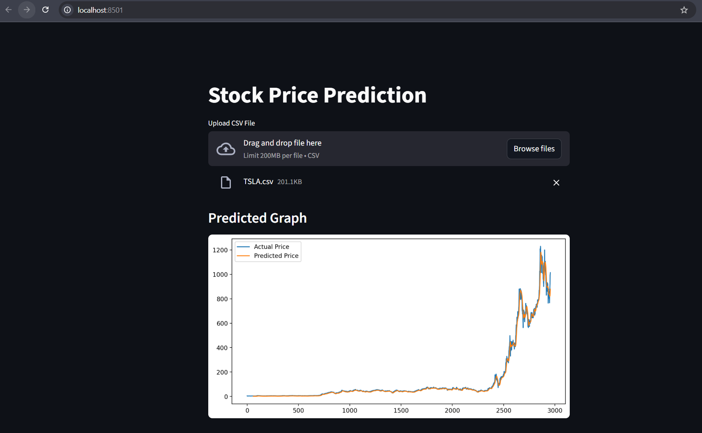

<h1 align="center">🚀 Stock Price Prediction using LSTM</h1>

<b>Deep Learning | Time Series Forecasting | Artificial Intelligence</b>

<h2>📌 Project Overview</h2>

This project builds a <b>Stock Price Prediction System</b> using 
<b>Deep Learning with LSTM (Long Short-Term Memory)</b> networks.

The system automatically downloads historical stock market data, 
processes it, trains a deep learning model, and saves the trained model 
for future predictions.

<ul>
<li>📊 Automatic stock data collection</li>
<li>🧠 Deep Learning LSTM model</li>
<li>📉 Time series forecasting</li>
<li>💾 Model saving for predictions</li>
</ul>

<h2>🧠 Model Architecture</h2>

<pre>
Input Data (60 Time Steps)
        ↓
LSTM Layer (50 Units)
        ↓
LSTM Layer (50 Units)
        ↓
Dense Layer
        ↓
Predicted Stock Price
</pre>

<table border="1" cellpadding="8">
<tr>
<th>Parameter</th>
<th>Value</th>
</tr>

<tr>
<td>Optimizer</td>
<td>Adam</td>
</tr>

<tr>
<td>Loss Function</td>
<td>Mean Squared Error</td>
</tr>

<tr>
<td>Epochs</td>
<td>5</td>
</tr>

<tr>
<td>Batch Size</td>
<td>32</td>
</tr>

</table>

<h2>🛠 Technologies Used</h2>

<ul>
<li>🐍 Python</li>
<li>🤖 TensorFlow / Keras</li>
<li>📊 Pandas</li>
<li>🔢 NumPy</li>
<li>📉 Scikit-Learn</li>
<li>📡 yFinance API</li>
<li>📈 Matplotlib</li>
<li>🌐 Streamlit</li>
</ul>

<h2>📂 Project Structure</h2>

<pre>
stock-price-prediction
│
├── data
│   └── stock.csv
│
├── model
│   └── train_model.py
│
├── utils
│   └── config.py
│
├── saved_model
│   └── lstm_stock_model.h5
│
├── main.py
├── requirements.txt
└── README.md
</pre>

<h2>⚙️ Installation</h2>

<h3>1️⃣ Clone Repository</h3>

<pre>
git clone https://github.com/yourusername/stock-price-prediction.git
</pre>

<h3>2️⃣ Open Project Folder</h3>

<pre>
cd stock-price-prediction
</pre>

<h3>3️⃣ Install Libraries</h3>

<pre>
pip install -r requirements.txt
</pre>

<h2>▶️ Run the Project</h2>

<pre>
python main.py
</pre>

The program will automatically:

<ul>
<li>Download stock data</li>
<li>Preprocess the dataset</li>
<li>Train the LSTM model</li>
<li>Save the trained model</li>
</ul>

<h2>📊 Data Processing Pipeline</h2>

<pre>
Stock Data Download
        ↓
Select Closing Price
        ↓
Data Normalization
        ↓
Create Time Series Sequences
        ↓
Train LSTM Model
        ↓
Save Model
</pre>

<h2>💾 Model Output</h2>

The trained model will be saved in:

<pre>
saved_model/lstm_stock_model.h5
</pre>

This model can be used later for:

<ul>
<li>📊 Stock prediction</li>
<li>🌐 Web applications</li>
<li>📈 Real-time forecasting</li>
</ul>

<h2>📈 Example Prediction Graph</h2>

<h2>🔮 Future Improvements</h2>

<ul>
<li>✨ Interactive Streamlit dashboard</li>
<li>📡 Real-time stock prediction</li>
<li>📊 Model accuracy visualization</li>
<li>☁️ Cloud deployment</li>
<li>📱 Web application interface</li>
</ul>

<h2>🤝 Contributing</h2>

Contributions are welcome!  
Feel free to fork the repository and submit pull requests.

<h2>📜 License</h2>

This project is licensed under the <b>MIT License</b>.

<h2>👨‍💻 Author</h2>

<b>Yogendra Maurya</b> 

⭐ If you like this project, please give it a star on GitHub!

